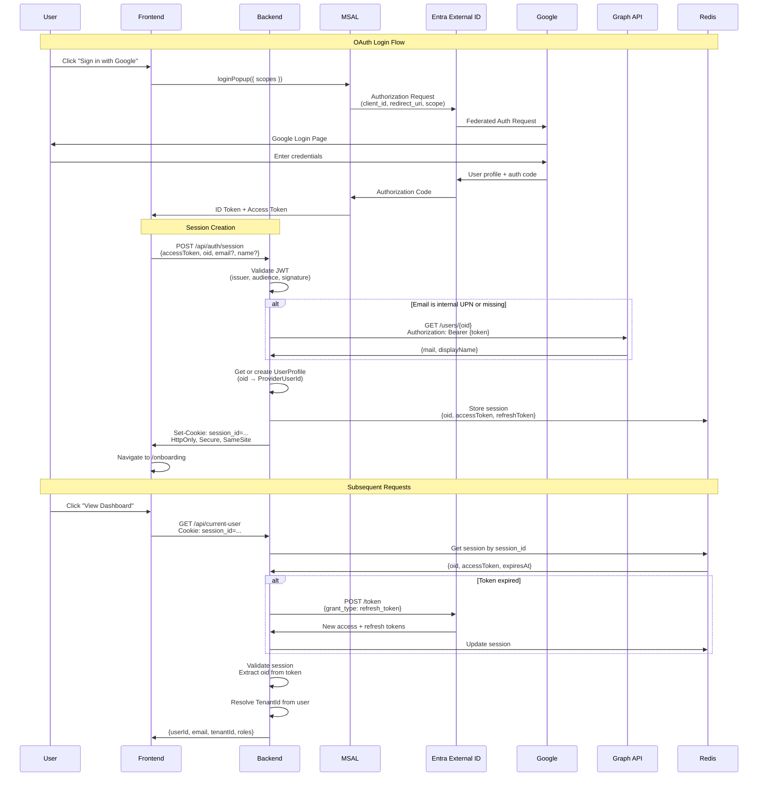

# Implementing OAuth 2.0 Authentication with Microsoft Entra External ID (CIAM)

**A practical guide to building production-ready OAuth authentication with session management, Google sign-in, and Graph API integration**

*Published: April 2026*

---

## Introduction

When building a multi-tenant SaaS platform, choosing the right authentication provider is crucial. After evaluating several options, we chose **Microsoft Entra External ID** (formerly Azure AD B2C's successor, CIAM - Customer Identity and Access Management) for our gymnastics session planning platform. This article walks through our implementation journey, including the architectural decisions, code patterns, and—most importantly—the gotchas we encountered along the way.

### Why Entra External ID?

- **Built-in OAuth 2.0 / OIDC support** - Industry-standard protocols
- **Social identity providers** - Google, Facebook, Microsoft accounts out of the box
- **Email/password authentication** - For testing and admin access
- **Scalable** - Microsoft's infrastructure handles millions of users
- **Integrated with Azure ecosystem** - Graph API, App Insights, Key Vault
- **Custom branding** - White-label authentication flows
- **User management** - Built-in admin portal and Graph API access

## Architecture Overview

Our authentication system consists of three main components:

1. **Frontend (React + MSAL.js)** - Handles OAuth redirect flow using Microsoft Authentication Library
2. **Backend API (ASP.NET Core)** - Validates JWTs, manages sessions, interfaces with Graph API
3. **Microsoft Entra External ID** - OAuth provider, user store, token issuer

We made a deliberate choice to use **session-based authentication** instead of storing JWTs in the frontend:

- **Security**: HTTP-only cookies prevent XSS attacks
- **Token refresh**: Backend handles token refresh transparently
- **Flexibility**: Can switch identity providers without changing frontend code
- **Revocation**: Can invalidate sessions immediately via Redis

## System Flow Diagram

Here's how the complete authentication flow works:



### Key Systems and Their Responsibilities

| System | Responsibility | Claims/Data |
|--------|---------------|-------------|
| **Entra External ID** | Token issuer, user store | `iss`, `aud`, `oid` (object ID), `sub`, `tid` (tenant ID) |
| **Google OAuth** | Social identity provider | Profile data (may contain internal UPN) |
| **Graph API** | User profile enrichment | `mail`, `displayName`, `userPrincipalName` |
| **Backend API** | JWT validation, session management | Validates `iss`, `aud`, `exp`, `nbf`, signature |
| **Redis** | Session store | `{oid, accessToken, refreshToken, expiresAt}` |
| **Frontend (MSAL)** | OAuth redirect flow orchestration | Handles PKCE, state, nonce |

## Implementation Steps

### 1. Setting Up Microsoft Entra External ID

#### Create an External ID Tenant

```bash
# Via Azure Portal
1. Navigate to "Microsoft Entra External ID"
2. Create new tenant → Choose "External ID (CIAM)"
3. Note your tenant ID: {your-tenant-id}
4. Your authority will be: https://{tenantId}.ciamlogin.com/{tenantId}
```

#### Register Your Application

```bash
# App Registration
Name: Gymnastics Platform API
Supported account types: Accounts in this organizational directory only
Redirect URIs:
  - SPA: http://localhost:3001/auth/callback
  - SPA: https://yourdomain.com/auth/callback

# Authentication → Implicit grant (disabled for security)
# Tokens → Access tokens: Enabled
# Tokens → ID tokens: Enabled

# API Permissions
Microsoft Graph:
  - User.Read (Delegated) - Read user profile
  - User.Read.All (Application) - For Graph API calls

# Certificates & Secrets
Create client secret: <store in Azure Key Vault>

# Expose an API
Application ID URI: api://{tenantId}/gymnastics-api
Scopes:
  - user.access (Admin and users) - "Access the API as the user"
```

#### Configure Google as Identity Provider

**In Google Cloud Console** (console.cloud.google.com):

```bash
# Create OAuth 2.0 Client ID
1. Navigate to APIs & Services → Credentials
2. Create OAuth 2.0 Client ID → Web application
3. Configure OAuth consent screen (External)
   - Add scopes: email, profile, openid
   - Add test users if needed
4. Add ALL these authorized redirect URIs:
   - https://{tenantId}.ciamlogin.com/{tenantId}/oauth2/authresp
   - https://{tenantId}.ciamlogin.com/{tenantId}/federation/oauth2
   - https://{tenantId}.ciamlogin.com/oauth2/authresp
   - https://{tenantId}.ciamlogin.com/federation/oauth2
   (Entra uses different formats for different flows - add all to be safe)
5. Copy Client ID and Client Secret
```

**In Microsoft Entra External ID**:

```bash
# Add Google as Identity Provider
1. Navigate to External Identities → Identity providers
2. Click "+ Google"
3. Paste Google Client ID and Client Secret
4. Save
```

**CRITICAL**: There is **no claim mapping configuration** for Google in Entra External ID. You simply provide the client credentials and Entra federates to Google. This is exactly why you'll encounter issues:

- Google returns whatever claims it wants
- Entra creates a user object with a generated `userPrincipalName`
- The `email` claim in the ID token might be an **internal UPN** like `user_gmail.com#EXT#@yourtenant.onmicrosoft.com`
- You **cannot configure** Entra to fix this

**Solution**: The Graph API fallback shown in the code examples is **mandatory, not optional**. Always check if the email is an internal UPN pattern and call Graph API to get the real email address.

### 2. Backend Implementation (ASP.NET Core)

#### appsettings.json Configuration

```json
{
  "Authentication": {
    "ExternalId": {
      "TenantId": "{your-tenant-id}",
      "Authority": "https://{your-tenant-id}.ciamlogin.com/{your-tenant-id}",
      "ApiClientId": "{your-client-id}",
      "ApiClientSecret": "<from-key-vault>",
      "Scopes": "api://gymnastics-api/user.access"
    }
  },
  "ConnectionStrings": {
    "Redis": "localhost:6379"
  }
}
```

#### Program.cs - Authentication Setup

```csharp
using Microsoft.Identity.Web;
using Microsoft.IdentityModel.Protocols.OpenIdConnect;

var builder = WebApplication.CreateBuilder(args);

// JWT Bearer authentication for API endpoints
builder.Services.AddAuthentication(JwtBearerDefaults.AuthenticationScheme)
    .AddMicrosoftIdentityWebApi(options =>
    {
        builder.Configuration.Bind("Authentication:ExternalId", options);

        // Accept both issuer formats (subdomain and path-based)
        options.TokenValidationParameters.ValidIssuers = new[]
        {
            $"{options.Authority}/v2.0",
            $"https://{tenantId}.ciamlogin.com/{tenantId}/v2.0"
        };

        // Accept API scope and client ID as audiences
        options.TokenValidationParameters.ValidAudiences = new[]
        {
            $"api://{tenantId}/gymnastics-api",
            configuration["Authentication:ExternalId:ApiClientId"]
        };
    },
    options => builder.Configuration.Bind("Authentication:ExternalId", options));

// Redis-backed session store
builder.Services.AddStackExchangeRedisCache(options =>
{
    options.Configuration = builder.Configuration.GetConnectionString("Redis");
    options.InstanceName = "GymnasticsAuth:";
});

builder.Services.AddSingleton<ISessionService, SessionService>();

var app = builder.Build();

app.UseAuthentication();
app.UseAuthorization();

// Custom middleware to resolve tenant context from session
app.UseMiddleware<TenantResolutionMiddleware>();

app.MapEndpoints(); // Auto-discover all IEndpointGroup implementations
```

#### Session Service Implementation

```csharp
public interface ISessionService
{
    Task<string> CreateSessionAsync(
        string providerUserId,
        string accessToken,
        string refreshToken,
        TimeSpan expiry,
        CancellationToken ct = default);

    Task<SessionData?> GetSessionAsync(string sessionId, CancellationToken ct = default);
    Task DeleteSessionAsync(string sessionId, CancellationToken ct = default);
}

public sealed record SessionData
{
    public required string ProviderUserId { get; init; }
    public required string AccessToken { get; init; }
    public required string RefreshToken { get; init; }
    public required DateTimeOffset ExpiresAt { get; init; }
}

public sealed class SessionService(
    IDistributedCache cache,
    ILogger<SessionService> logger) : ISessionService
{
    public async Task<string> CreateSessionAsync(
        string providerUserId,
        string accessToken,
        string refreshToken,
        TimeSpan expiry,
        CancellationToken ct = default)
    {
        var sessionId = Guid.NewGuid().ToString();
        var sessionData = new SessionData
        {
            ProviderUserId = providerUserId,
            AccessToken = accessToken,
            RefreshToken = refreshToken,
            ExpiresAt = DateTimeOffset.UtcNow.Add(expiry)
        };

        var json = JsonSerializer.Serialize(sessionData);
        await cache.SetStringAsync(
            sessionId,
            json,
            new DistributedCacheEntryOptions
            {
                AbsoluteExpiration = sessionData.ExpiresAt,
                SlidingExpiration = TimeSpan.FromMinutes(20)
            },
            ct);

        return sessionId;
    }

    public async Task<SessionData?> GetSessionAsync(string sessionId, CancellationToken ct = default)
    {
        var json = await cache.GetStringAsync(sessionId, ct);
        return json is null ? null : JsonSerializer.Deserialize<SessionData>(json);
    }

    public async Task DeleteSessionAsync(string sessionId, CancellationToken ct = default)
    {
        await cache.RemoveAsync(sessionId, ct);
    }
}
```

#### Authentication Endpoints

```csharp
public sealed class AuthEndpoints : IEndpointGroup
{
    public void Map(IEndpointRouteBuilder app)
    {
        var group = app.MapGroup("/api/auth").WithTags("Authentication");

        group.MapPost("/session", CreateSession)
            .WithName("CreateSession")
            .AllowAnonymous();

        group.MapPost("/logout", Logout)
            .RequireAuthorization();

        group.MapGet("/me", GetCurrentUser)
            .RequireAuthorization();
    }

    private static async Task<IResult> CreateSession(
        CreateSessionRequest request,
        IAuthenticationProvider authProvider,
        ISessionService sessionService,
        AuthDbContext db,
        HttpContext httpContext,
        TimeProvider clock,
        IHostEnvironment env,
        CancellationToken ct)
    {
        if (string.IsNullOrEmpty(request.AccessToken))
        {
            return Results.Problem(
                statusCode: StatusCodes.Status400BadRequest,
                detail: "Access token is required");
        }

        var logger = httpContext.RequestServices.GetRequiredService<ILogger<AuthEndpoints>>();
        var providerUserId = request.ProviderUserId;
        var email = request.Email;
        var name = request.FullName;

        // Check if email is an internal UPN (not a real email address)
        var isInternalUpn = !string.IsNullOrWhiteSpace(email)
            && email.Contains("@gymnasticsciam.onmicrosoft.com");

        // If email/name is missing OR email is internal UPN, use Graph API
        if (string.IsNullOrWhiteSpace(email)
            || string.IsNullOrWhiteSpace(name)
            || isInternalUpn)
        {
            logger.LogInformation(
                "Email or name missing/invalid from ID token, calling Graph API for user: {ProviderId}",
                providerUserId);

            var graphResult = await authProvider.GetProviderUserInfoAsync(providerUserId, ct);

            if (graphResult.IsSuccess && graphResult.Value is not null)
            {
                var graphInfo = graphResult.Value;
                logger.LogInformation(
                    "Graph API returned email: {Email}, fullName: {FullName}",
                    graphInfo.Email,
                    graphInfo.FullName);

                email = graphInfo.Email;
                name = graphInfo.FullName ?? name;
            }
            else
            {
                logger.LogWarning("Graph API call failed or returned null");
                return Results.Problem(
                    statusCode: StatusCodes.Status500InternalServerError,
                    detail: "Could not retrieve user information");
            }
        }

        // Get or create user profile
        var userProfile = await db.UserProfiles
            .IgnoreQueryFilters()
            .FirstOrDefaultAsync(u => u.ProviderUserId == providerUserId, ct);

        if (userProfile is null)
        {
            // New OAuth user - create profile in onboarding tenant
            userProfile = UserProfile.Create(
                OnboardingTenantId,
                providerUserId,
                email,
                name,
                clock.GetUtcNow());

            db.UserProfiles.Add(userProfile);
            await db.SaveChangesAsync(ct);
        }
        else
        {
            userProfile.RecordLogin(clock.GetUtcNow());
            await db.SaveChangesAsync(ct);
        }

        // Create server-side session
        var sessionId = await sessionService.CreateSessionAsync(
            providerUserId: providerUserId,
            accessToken: request.AccessToken,
            refreshToken: "", // MSAL manages refresh tokens
            expiry: TimeSpan.FromHours(1),
            ct);

        // Set HTTP-only cookie
        httpContext.Response.Cookies.Append("session_id", sessionId, new CookieOptions
        {
            HttpOnly = true,
            Secure = httpContext.Request.IsHttps,
            SameSite = env.IsDevelopment() ? SameSiteMode.Lax : SameSiteMode.Strict,
            MaxAge = TimeSpan.FromMinutes(20)
        });

        return Results.Ok(new
        {
            UserId = providerUserId,
            Email = email,
            FullName = name,
            TenantId = userProfile.TenantId,
            OnboardingCompleted = userProfile.OnboardingCompleted
        });
    }
}

public sealed record CreateSessionRequest(
    string AccessToken,
    string ProviderUserId,  // From ID token 'oid' claim
    string? Email,          // From ID token (optional - will fallback to Graph API)
    string? FullName        // From ID token (optional - will fallback to Graph API)
);
```

#### Graph API Integration

```csharp
public interface IAuthenticationProvider
{
    Task<Result<ProviderUserInfo?>> GetProviderUserInfoAsync(
        string providerUserId,
        CancellationToken ct = default);
}

public sealed class ExternalIdAuthenticationProvider(
    IHttpClientFactory httpClientFactory,
    IConfiguration configuration,
    ILogger<ExternalIdAuthenticationProvider> logger) : IAuthenticationProvider
{
    public async Task<Result<ProviderUserInfo?>> GetProviderUserInfoAsync(
        string providerUserId,
        CancellationToken ct = default)
    {
        try
        {
            // Use client credentials flow to get app-only access token
            var tokenResponse = await GetAppOnlyAccessTokenAsync(ct);

            if (!tokenResponse.IsSuccess)
            {
                logger.LogError("Failed to get app-only access token: {Error}",
                    tokenResponse.ErrorMessage);
                return Result.Failure<ProviderUserInfo?>(
                    ErrorType.Internal,
                    "Failed to authenticate with Graph API");
            }

            var accessToken = tokenResponse.Value;
            var client = httpClientFactory.CreateClient("GraphApi");
            client.DefaultRequestHeaders.Authorization =
                new AuthenticationHeaderValue("Bearer", accessToken);

            // Call Graph API to get user profile
            var response = await client.GetAsync(
                $"https://graph.microsoft.com/v1.0/users/{providerUserId}?$select=mail,displayName,userPrincipalName",
                ct);

            if (!response.IsSuccessStatusCode)
            {
                logger.LogError(
                    "Graph API returned {StatusCode}: {Content}",
                    response.StatusCode,
                    await response.Content.ReadAsStringAsync(ct));

                return Result.Failure<ProviderUserInfo?>(
                    ErrorType.Internal,
                    $"Graph API returned {response.StatusCode}");
            }

            var userJson = await response.Content.ReadFromJsonAsync<JsonElement>(ct);
            var email = userJson.GetProperty("mail").GetString();
            var displayName = userJson.GetProperty("displayName").GetString();

            return Result.Success<ProviderUserInfo?>(new ProviderUserInfo(
                ProviderUserId: providerUserId,
                Email: email ?? "",
                FullName: displayName));
        }
        catch (Exception ex)
        {
            logger.LogError(ex, "Failed to get user info from Graph API for user {UserId}",
                providerUserId);
            return Result.Failure<ProviderUserInfo?>(
                ErrorType.Internal,
                "Failed to retrieve user information");
        }
    }

    private async Task<Result<string>> GetAppOnlyAccessTokenAsync(CancellationToken ct)
    {
        var config = configuration.GetSection("Authentication:ExternalId");
        var tenantId = config["TenantId"];
        var clientId = config["ApiClientId"];
        var clientSecret = config["ApiClientSecret"];

        var client = httpClientFactory.CreateClient();
        var content = new FormUrlEncodedContent(new[]
        {
            new KeyValuePair<string, string>("client_id", clientId!),
            new KeyValuePair<string, string>("client_secret", clientSecret!),
            new KeyValuePair<string, string>("scope", "https://graph.microsoft.com/.default"),
            new KeyValuePair<string, string>("grant_type", "client_credentials")
        });

        var response = await client.PostAsync(
            $"https://login.microsoftonline.com/{tenantId}/oauth2/v2.0/token",
            content,
            ct);

        if (!response.IsSuccessStatusCode)
        {
            return Result.Failure<string>(
                ErrorType.Unauthorized,
                "Failed to get access token");
        }

        var tokenJson = await response.Content.ReadFromJsonAsync<JsonElement>(ct);
        var accessToken = tokenJson.GetProperty("access_token").GetString();

        return Result.Success(accessToken!);
    }
}

public sealed record ProviderUserInfo(
    string ProviderUserId,
    string Email,
    string? FullName);
```

### 3. Frontend Implementation (React + MSAL)

#### MSAL Configuration

```typescript
// src/msal-config.ts
import { PublicClientApplication, LogLevel } from '@azure/msal-browser';

const tenantId = import.meta.env.VITE_TENANT_ID;
const clientId = import.meta.env.VITE_CLIENT_ID;

export const msalConfig = {
  auth: {
    clientId: clientId,
    authority: `https://${tenantId}.ciamlogin.com/${tenantId}`,
    redirectUri: window.location.origin + '/auth/callback',
    postLogoutRedirectUri: window.location.origin,
  },
  cache: {
    cacheLocation: 'sessionStorage',
    storeAuthStateInCookie: false,
  },
  system: {
    loggerOptions: {
      loggerCallback: (level: LogLevel, message: string, containsPii: boolean) => {
        if (containsPii) return;
        switch (level) {
          case LogLevel.Error:
            console.error(message);
            break;
          case LogLevel.Warning:
            console.warn(message);
            break;
          default:
            break;
        }
      },
    },
  },
};

export const msalInstance = new PublicClientApplication(msalConfig);

// Scopes for API access
export const apiScopes = {
  user: [`api://${tenantId}/gymnastics-api/user.access`],
};
```

#### Authentication Context

```typescript
// src/contexts/AuthContext.tsx
import { createContext, useContext, useEffect, useState } from 'react';
import { msalInstance, apiScopes } from '../msal-config';
import { InteractionRequiredAuthError } from '@azure/msal-browser';

interface AuthContextType {
  isAuthenticated: boolean;
  isLoading: boolean;
  user: User | null;
  loginWithOAuth: (provider: 'google' | 'microsoft') => Promise<void>;
  logout: () => Promise<void>;
}

const AuthContext = createContext<AuthContextType | undefined>(undefined);

export function AuthProvider({ children }: { children: React.ReactNode }) {
  const [isAuthenticated, setIsAuthenticated] = useState(false);
  const [isLoading, setIsLoading] = useState(true);
  const [user, setUser] = useState<User | null>(null);

  useEffect(() => {
    // Check if user has active session on mount
    checkSession();
  }, []);

  const checkSession = async () => {
    try {
      const response = await fetch('/api/auth/me', {
        credentials: 'include',
      });

      if (response.ok) {
        const userData = await response.json();
        setUser(userData);
        setIsAuthenticated(true);
      }
    } catch (error) {
      console.error('Session check failed:', error);
    } finally {
      setIsLoading(false);
    }
  };

  const loginWithOAuth = async (provider: 'google' | 'microsoft') => {
    setIsLoading(true);
    try {
      // Trigger OAuth flow via MSAL
      const loginRequest = {
        scopes: apiScopes.user,
        prompt: 'select_account',
        domainHint: provider === 'google' ? 'google.com' : undefined,
      };

      const result = await msalInstance.loginPopup(loginRequest);

      // Extract user info from ID token
      const idToken = result.idToken;
      const account = result.account;

      // Get access token for API
      const tokenRequest = {
        scopes: apiScopes.user,
        account: account,
      };

      let accessToken: string;
      try {
        const tokenResponse = await msalInstance.acquireTokenSilent(tokenRequest);
        accessToken = tokenResponse.accessToken;
      } catch (error) {
        if (error instanceof InteractionRequiredAuthError) {
          const tokenResponse = await msalInstance.acquireTokenPopup(tokenRequest);
          accessToken = tokenResponse.accessToken;
        } else {
          throw error;
        }
      }

      // Create backend session
      const sessionResponse = await fetch('/api/auth/session', {
        method: 'POST',
        headers: {
          'Content-Type': 'application/json',
        },
        credentials: 'include',
        body: JSON.stringify({
          accessToken: accessToken,
          providerUserId: account.localAccountId, // 'oid' claim
          email: account.username, // May be internal UPN
          fullName: account.name,
        }),
      });

      if (!sessionResponse.ok) {
        throw new Error('Failed to create session');
      }

      const userData = await sessionResponse.json();
      setUser(userData);
      setIsAuthenticated(true);

      // Redirect based on onboarding status
      if (userData.onboardingCompleted) {
        window.location.href = '/dashboard';
      } else {
        window.location.href = '/onboarding';
      }
    } catch (error) {
      console.error('OAuth login failed:', error);
      throw error;
    } finally {
      setIsLoading(false);
    }
  };

  const logout = async () => {
    try {
      // Clear backend session
      await fetch('/api/auth/logout', {
        method: 'POST',
        credentials: 'include',
      });

      // Clear MSAL session
      await msalInstance.logoutPopup();

      setUser(null);
      setIsAuthenticated(false);
    } catch (error) {
      console.error('Logout failed:', error);
    }
  };

  return (
    <AuthContext.Provider value={{
      isAuthenticated,
      isLoading,
      user,
      loginWithOAuth,
      logout
    }}>
      {children}
    </AuthContext.Provider>
  );
}

export const useAuth = () => {
  const context = useContext(AuthContext);
  if (!context) {
    throw new Error('useAuth must be used within AuthProvider');
  }
  return context;
};
```

#### Sign-In Page

```typescript
// src/pages/SignInPage.tsx
import { useState } from 'react';
import { useAuth } from '../contexts/AuthContext';

export function SignInPage() {
  const [error, setError] = useState('');
  const { loginWithOAuth, isLoading } = useAuth();

  const handleGoogleLogin = async () => {
    setError('');
    try {
      await loginWithOAuth('google');
    } catch (err) {
      setError(err instanceof Error ? err.message : 'Google sign-in failed');
    }
  };

  const handleMicrosoftLogin = async () => {
    setError('');
    try {
      await loginWithOAuth('microsoft');
    } catch (err) {
      setError(err instanceof Error ? err.message : 'Microsoft sign-in failed');
    }
  };

  return (
    <div className="auth-container">
      <h1>Sign In</h1>
      {error && <div className="error">{error}</div>}

      <button onClick={handleGoogleLogin} disabled={isLoading}>
        <GoogleIcon />
        Continue with Google
      </button>

      <button onClick={handleMicrosoftLogin} disabled={isLoading}>
        <MicrosoftIcon />
        Sign in with Microsoft
      </button>
    </div>
  );
}
```

## Gotchas and Lessons Learned

### 1. The Email Address Mystery 🕵️

**Problem**: When users authenticated via Google through Entra External ID, the email claim in the ID token was **frequently** an internal UPN like `user_gmail.com#EXT#@{yourtenant}.onmicrosoft.com` instead of their actual email address.

**Why it happens**:
1. Entra External ID creates a user object in its directory for every external user
2. When Google federation is configured, you **cannot configure claim mapping** (there's no UI for it - only client ID and secret)
3. Entra generates a `userPrincipalName` based on the external identity
4. This generated UPN frequently ends up in the `email` claim instead of the user's real email
5. **There is no way to fix this via configuration** - it's a limitation of how Entra handles federated Google identities

**The ONLY Solution**: Always check if the email is an internal UPN pattern, and make a Graph API call to retrieve the actual user profile. This is **not optional**:

```csharp
var isInternalUpn = !string.IsNullOrWhiteSpace(email)
    && email.Contains("@gymnasticsciam.onmicrosoft.com");

if (string.IsNullOrWhiteSpace(email)
    || string.IsNullOrWhiteSpace(name)
    || isInternalUpn)
{
    // Fallback to Graph API
    var graphResult = await authProvider.GetProviderUserInfoAsync(providerUserId, ct);
    if (graphResult.IsSuccess)
    {
        email = graphResult.Value.Email;
        name = graphResult.Value.FullName ?? name;
    }
}
```

**Key takeaway**: With Google federation in Entra External ID:
- You **cannot configure claim mapping** (limitation of the platform)
- The `email` claim will **frequently** be an internal UPN, not a real email
- Graph API fallback is **mandatory**, not optional
- Always validate the email format and call Graph API when it's an internal UPN

### 2. JWT Validation: Issuer Format Variations

**Problem**: JWT validation was failing because the `iss` claim format varied depending on how the user authenticated.

**Why it happens**: Entra External ID can issue tokens with two different issuer formats:
- Path-based: `https://gymnasticsciam.ciamlogin.com/{tenantId}/v2.0`
- Subdomain: `https://{tenantId}.ciamlogin.com/{tenantId}/v2.0`

**Solution**: Accept both issuer formats in your `TokenValidationParameters`:

```csharp
options.TokenValidationParameters.ValidIssuers = new[]
{
    $"{authority}/v2.0",
    $"https://{tenantId}.ciamlogin.com/{tenantId}/v2.0"
};
```

### 3. Audience Claim Confusion

**Problem**: Tokens were being rejected because the `aud` claim didn't match our expected audience.

**Why it happens**: Different flows use different audiences:
- OAuth flow with scopes: `api://{tenantId}/gymnastics-api`
- ROPC (email/password): Client ID directly

**Solution**: Accept multiple audiences:

```csharp
options.TokenValidationParameters.ValidAudiences = new[]
{
    $"api://{tenantId}/gymnastics-api",
    configuration["Authentication:ExternalId:ApiClientId"]
};
```

### 4. Testing Challenges: Mock vs. Real Validation

**Problem**: Integration tests were failing because they couldn't validate JWTs signed with test keys against the real OIDC discovery endpoint.

**Solution**: Add environment-specific validation logic:

```csharp
if (env.EnvironmentName == "Test")
{
    // Use test signing key that matches MockAuthenticationProvider
    var testSigningKey = new SymmetricSecurityKey(
        Encoding.UTF8.GetBytes("test-secret-key-for-integration-tests-12345678"));

    validationParameters.IssuerSigningKey = testSigningKey;
}
else
{
    // Production: Fetch keys from OIDC discovery endpoint
    var oidcConfig = await configManager.GetConfigurationAsync(ct);
    validationParameters.IssuerSigningKeys = oidcConfig.SigningKeys;
}
```

**Key takeaway**: Don't skip validation in tests—use the same validation logic with test-appropriate keys.

### 5. Session Management: Redis vs. In-Memory

**Problem**: Local development was painful because Redis wasn't always running, causing session creation to fail.

**Solution**: Use a mock session service for integration tests:

```csharp
// In TestWebApplicationFactory.ConfigureTestServices
services.RemoveAll(typeof(ISessionService));
services.AddSingleton<ISessionService>(new MockSessionService());
```

For local development, consider using an in-memory cache that falls back to Redis in production:

```csharp
if (builder.Environment.IsDevelopment())
{
    builder.Services.AddDistributedMemoryCache();
}
else
{
    builder.Services.AddStackExchangeRedisCache(options =>
    {
        options.Configuration = builder.Configuration.GetConnectionString("Redis");
    });
}
```

### 6. Cookie SameSite Policies

**Problem**: Session cookies weren't being sent in cross-origin requests during local development (frontend on :3001, API on :5001).

**Solution**: Use `SameSite=Lax` in development, `SameSite=Strict` in production:

```csharp
httpContext.Response.Cookies.Append("session_id", sessionId, new CookieOptions
{
    HttpOnly = true,
    Secure = httpContext.Request.IsHttps,
    SameSite = env.IsDevelopment() ? SameSiteMode.Lax : SameSiteMode.Strict,
    MaxAge = TimeSpan.FromMinutes(20)
});
```

**Also configure CORS properly**:

```csharp
builder.Services.AddCors(options =>
{
    options.AddPolicy("Development", policy =>
    {
        policy.WithOrigins("http://localhost:3001")
              .AllowAnyMethod()
              .AllowAnyHeader()
              .AllowCredentials(); // Required for cookies
    });
});
```

### 7. Token Expiration vs. Session Expiration

**Problem**: Confusion about when to refresh tokens and how long sessions should last.

**Our approach**:
- **Access tokens**: Short-lived (1 hour), automatically refreshed by backend when expired
- **Session cookies**: Sliding expiration (20 minutes idle timeout)
- **User inactivity**: After 20 minutes of no API calls, session expires and user must re-authenticate

**Implementation**:

```csharp
// In session retrieval middleware
var sessionData = await sessionService.GetSessionAsync(sessionId, ct);

if (sessionData.ExpiresAt < DateTimeOffset.UtcNow)
{
    // Token expired - attempt refresh
    var refreshResult = await authProvider.RefreshTokenAsync(
        sessionData.RefreshToken,
        ct);

    if (refreshResult.IsSuccess)
    {
        // Update session with new tokens
        await sessionService.UpdateSessionAsync(sessionId, new SessionData
        {
            ProviderUserId = sessionData.ProviderUserId,
            AccessToken = refreshResult.Value.AccessToken,
            RefreshToken = refreshResult.Value.RefreshToken,
            ExpiresAt = DateTimeOffset.UtcNow.AddSeconds(refreshResult.Value.ExpiresIn)
        }, ct);
    }
}
```

### 8. MSAL Redirect vs. Popup

**Problem**: Redirect flow was causing loss of application state and a poor UX during authentication.

**Solution**: Use popup flow for a smoother experience:

```typescript
// Popup flow - user stays on same page
const result = await msalInstance.loginPopup(loginRequest);

// Redirect flow - full page redirect (avoid unless necessary)
// await msalInstance.loginRedirect(loginRequest);
```

**Trade-off**: Popup flow requires pop-up blocker to be disabled, but provides better UX. Document this requirement for users.

## Security Considerations

### 1. Token Storage

❌ **NEVER** store tokens in localStorage or sessionStorage (vulnerable to XSS)
✅ **ALWAYS** use HTTP-only cookies for session IDs
✅ Store actual tokens server-side in Redis with encryption at rest

### 2. CORS Configuration

```csharp
// Production: Explicit origins only
builder.Services.AddCors(options =>
{
    options.AddPolicy("Production", policy =>
    {
        policy.WithOrigins("https://app.yourdomain.com")
              .AllowAnyMethod()
              .AllowAnyHeader()
              .AllowCredentials();
    });
});
```

❌ **NEVER** use `.AllowAnyOrigin()` in production

### 3. Client Secret Management

✅ Store in Azure Key Vault:

```csharp
builder.Configuration.AddAzureKeyVault(
    new Uri($"https://{keyVaultName}.vault.azure.net/"),
    new DefaultAzureCredential());

var clientSecret = builder.Configuration["Authentication:ExternalId:ApiClientSecret"];
```

❌ Never commit secrets to source control
❌ Never log secrets (even in debug mode)

### 4. Graph API Permissions

Use **least privilege principle**:
- `User.Read` (Delegated) - For user's own profile
- `User.Read.All` (Application) - Only for admin scenarios where you need to read other users

**Consent flow**: Always request consent for the minimum scopes needed.

## Performance Optimization

### 1. Redis Connection Pooling

```csharp
builder.Services.AddStackExchangeRedisCache(options =>
{
    options.Configuration = builder.Configuration.GetConnectionString("Redis");
    options.InstanceName = "GymnasticsAuth:";

    // Connection pooling and timeouts
    options.ConfigurationOptions = new ConfigurationOptions
    {
        AbortOnConnectFail = false,
        ConnectTimeout = 5000,
        SyncTimeout = 5000,
    };
});
```

### 2. Graph API Caching

Cache Graph API responses for non-critical user data:

```csharp
private readonly IMemoryCache _cache;

public async Task<ProviderUserInfo?> GetProviderUserInfoAsync(
    string providerUserId,
    CancellationToken ct)
{
    var cacheKey = $"user:{providerUserId}";

    if (_cache.TryGetValue(cacheKey, out ProviderUserInfo? cached))
    {
        return cached;
    }

    var userInfo = await FetchFromGraphApiAsync(providerUserId, ct);

    _cache.Set(cacheKey, userInfo, TimeSpan.FromMinutes(5));

    return userInfo;
}
```

### 3. Token Validation Caching

OIDC configuration is cached automatically by Microsoft.IdentityModel, but you can tune it:

```csharp
var configManager = new ConfigurationManager<OpenIdConnectConfiguration>(
    discoveryEndpoint,
    new OpenIdConnectConfigurationRetriever(),
    new HttpDocumentRetriever())
{
    AutomaticRefreshInterval = TimeSpan.FromHours(12),
    RefreshInterval = TimeSpan.FromMinutes(30)
};
```

## Monitoring and Observability

### 1. Structured Logging

```csharp
logger.LogInformation(
    "User {UserId} authenticated via {Provider} - Email: {Email}",
    providerUserId,
    "Google",
    email);

logger.LogWarning(
    "Email claim was internal UPN for user {UserId}, falling back to Graph API",
    providerUserId);
```

### 2. Application Insights

Track authentication metrics:

```csharp
telemetryClient.TrackEvent("UserAuthenticated", new Dictionary<string, string>
{
    ["UserId"] = providerUserId,
    ["Provider"] = "Google",
    ["EmailSource"] = isInternalUpn ? "GraphApi" : "IdToken"
});

telemetryClient.TrackMetric("SessionCreationTime", stopwatch.ElapsedMilliseconds);
```

### 3. Failed Authentication Tracking

```csharp
if (!authResult.IsSuccess)
{
    telemetryClient.TrackEvent("AuthenticationFailed", new Dictionary<string, string>
    {
        ["Provider"] = "Google",
        ["ErrorType"] = authResult.ErrorType.ToString(),
        ["ErrorMessage"] = authResult.ErrorMessage
    });
}
```

## Conclusion

Implementing OAuth 2.0 with Microsoft Entra External ID requires careful attention to detail, especially around claim validation, token management, and edge cases like the email UPN issue. Here are the key takeaways:

### ✅ Do:
- Use session-based authentication with HTTP-only cookies
- Validate JWT tokens properly (issuer, audience, signature, expiration)
- Have a Graph API fallback for user profile data
- Use environment-specific configuration for testing
- Implement proper error handling and logging
- Cache Graph API responses when appropriate
- Use MSAL popup flow for better UX

### ❌ Don't:
- Store tokens in localStorage/sessionStorage
- Skip JWT signature validation in tests
- Trust the email claim blindly
- Hardcode tenant IDs or client secrets
- Use `.AllowAnyOrigin()` in CORS for production
- Log sensitive data (tokens, secrets)

### 🔒 Security Checklist:
- [ ] Client secrets stored in Key Vault
- [ ] HTTP-only, Secure, SameSite cookies
- [ ] Proper CORS configuration
- [ ] JWT validation on every request
- [ ] Least privilege Graph API permissions
- [ ] Redis encryption at rest enabled
- [ ] HTTPS enforced in production
- [ ] Token refresh implemented
- [ ] Session expiration configured

The complete source code for this implementation is available on GitHub: [GymnasticsPlatform](https://github.com/RDCoached/GymnasticsPlatform)

---

**Questions or Issues?** Feel free to reach out or open an issue in the repository. Happy authenticating! 🚀
